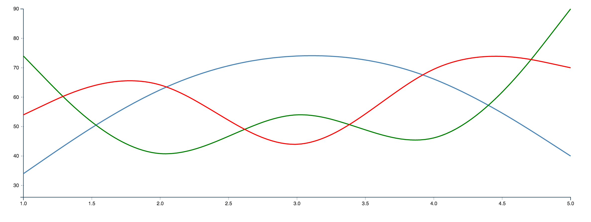

# d3line
>A simple line chart directive using d3js on Angular

[![NPM version][npm-image]][npm-url]

### Installation

Install using [Bower](https://bower.io):

```
bower install --save d3line
```

Install using [npm](https://www.npmjs.com/):

```
npm install --save d3line
```

### Using the d3line Directive

Include the `d3LineModule` dependency in your Angular module:

```
var app = angular.module('demoapp', ['d3LineModule']);
```

Fetch or Add the chart data into your controller in the following format:

```
$scope.chartData = [
  {series: 'A',x: 1,y: 34},
  {series: 'A',x: 2,y: 66},
  {series: 'A',x: 3,y: 77},
  {series: 'A',x: 4,y: 70},
  {series: 'A',x: 5,y: 40},

  {series: 'B',x: 1,y: 74},
  {series: 'B',x: 2,y: 26},
  {series: 'B',x: 3,y: 67},
  {series: 'B',x: 4,y: 30},
  {series: 'B',x: 5,y: 90},

  {series: 'C',x: 1,y: 54},
  {series: 'C',x: 2,y: 76},
  {series: 'C',x: 3,y: 27},
  {series: 'C',x: 4,y: 80},
  {series: 'C',x: 5,y: 70}
];
```

Now, to create the chart, use the following command:

```
<d3-line data="chartData" width="1200" height="400"></d3-line>
```

Here's how the chart looks:



### Getting to know D3

D3.js is an amazing visualization library with a lot of powerful features.
To learn more about D3, visit http://d3js.org

###LICENSE

MIT

[npm-image]: https://badge.fury.io/js/d3line.svg
[npm-url]: https://badge.fury.io/js/d3line
